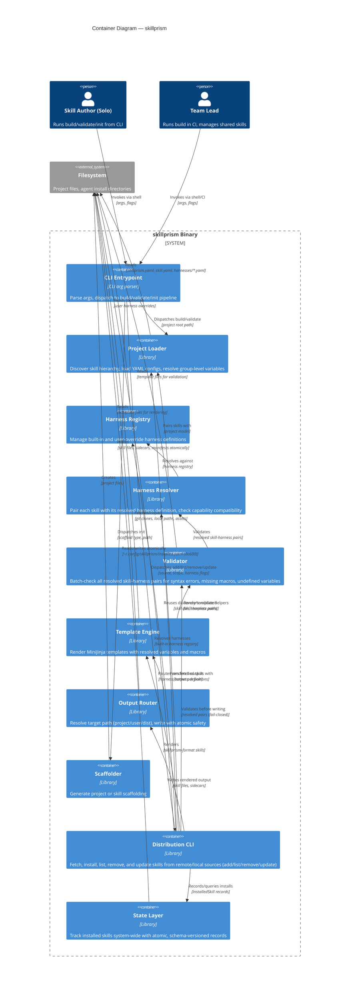

# Logical Containers

**Version:** v0.2.0

## Container Diagram

## Container Responsibilities

### CLI Entrypoint

| Field | Value |
| :--- | :--- |
| **Logical type** | CLI boundary |
| **Responsibility** | Parse command-line arguments (subcommand, flags, paths), validate flag combinations, dispatch to the correct pipeline handler (build, validate, init) |
| **Inputs** | Raw CLI args (`skillprism build --target user`, `skillprism validate`, `skillprism init`, etc.) |
| **Outputs** | Structured dispatch to build pipeline, validate pipeline, or scaffolder |
| **Depends on** | Nothing (entry point) |

### Project Loader

| Field | Value |
| :--- | :--- |
| **Logical type** | Library boundary |
| **Responsibility** | Walk the project directory tree starting from the project root. Discover and parse `skillprism.yaml`, traverse skill directories, load `skill.yaml` files per directory, resolve group-level variable inheritance (parent → child merge, child wins), and discover user harness overrides under `harnesses/` |
| **Inputs** | Project root path |
| **Outputs** | Resolved project model: list of skills (each with its resolved variables, template path, asset paths), list of user harness definitions |
| **Depends on** | Filesystem |

### Harness Registry

| Field | Value |
| :--- | :--- |
| **Logical type** | Library boundary |
| **Responsibility** | Maintain the set of built-in harness definitions (compiled into the binary). Accept user override harnesses (same name as built-in → fields merged or replaced) and custom harnesses (new name → added to registry) from the project loader. Resolve a harness definition by name to its full definition |
| **Inputs** | Harness name, optional user override definitions |
| **Outputs** | Resolved `HarnessDefinition` (built-in + user overrides applied) |
| **Depends on** | Compiled-in harness data, Project Loader (for user overrides) |

### Harness Resolver

| Field | Value |
| :--- | :--- |
| **Logical type** | Library boundary |
| **Responsibility** | For every skill in the project model, match it to the harness definition referenced in the project config. Check that each skill's `required_capabilities` are satisfied by the harness. Produce resolved pairs (skill + harness definition) for downstream stages. Collect all resolution errors across all skills before returning. |
| **Inputs** | Project model with skills and configured harness names, Harness Registry |
| **Outputs** | List of `ResolvedPair` (skill + harness), or list of `ResolveError` |
| **Depends on** | Project Loader, Harness Registry |

### Validator

| Field | Value |
| :--- | :--- |
| **Logical type** | Library boundary |
| **Responsibility** | For every resolved skill-harness pair: read the template file and check MiniJinja syntax by attempting to parse it, use MiniJinja's `undeclared_variables()` to find undefined variable references, scan template text for `harness.<macro_name>` refs and verify each resolves against the harness definition. Collect all errors across all pairs. Return valid pairs alongside errors (collect-all-errors pattern). |
| **Inputs** | List of `ResolvedPair` from Resolver |
| **Outputs** | `ValidationOutcome` — list of valid pairs + list of `ValidationError` |
| **Depends on** | Harness Resolver, Filesystem (template reads) |

### Template Engine

| Field | Value |
| :--- | :--- |
| **Logical type** | Library boundary |
| **Responsibility** | For a resolved skill-harness pair: read the template, build a MiniJinja context with skill variables (name, description, custom variables) and the `harness` object (id, name, version, macros as strings), register custom helpers (`skill_ref`), and render skill content, sidecars, and manifest entry. |
| **Inputs** | `ResolvedPair` (skill + harness) |
| **Outputs** | `HarnessOutput` (skill_content, sidecars, manifest_entry) or `EngineError` |
| **Depends on** | Harness Resolver, Filesystem (template reads), MiniJinja runtime |

### Output Router

| Field | Value |
| :--- | :--- |
| **Logical type** | Library boundary |
| **Responsibility** | Resolve the target output path for a resolved skill-harness pair based on target scope (project paths vs user home paths vs `dist/`) using the harness definition's installation path table. Write the rendered `SKILL.md`, sidecar files, and manifest entries. Copy shared asset directories (references/, scripts/). Perform atomic writes (temp `.tmp` file → `rename`). Create parent directories as needed. |
| **Inputs** | `ResolvedPair`, `HarnessOutput`, `TargetScope`, project root path |
| **Outputs** | `WrittenFiles` (skill_path, sidecar_paths) or `RouterError` |
| **Depends on** | Harness Resolver (for paths), Filesystem |

### Scaffolder

| Field | Value |
| :--- | :--- |
| **Logical type** | Library boundary |
| **Responsibility** | Generate a new skillprism project directory (P1: SC-1) or scaffold a single skill within an existing project (P1: SC-2). Create `skillprism.yaml`, sample skill template, `harnesses/` directory placeholder. |
| **Inputs** | Scaffold type, target path, project name |
| **Outputs** | Created directory tree and files on disk |
| **Depends on** | Filesystem |

### Distribution CLI

| Field | Value |
| :--- | :--- |
| **Logical type** | Library boundary |
| **Responsibility** | Implement the distribution commands (Epic I, DIST-I001–I010): `add` (parse source, fetch via the git auth chain or local copy, detect skillprism vs plain format, render/copy per harness, record state), `list`, `remove`, and `update` (ls-remote no-op check, per-file SHA-256 change detection, `--diff`). Reuse the build-time containers (loader discovery/template helpers, registry, resolver, validator, engine, router) rather than re-implementing them; validate every resolved pair before writing (fail-closed). Harden untrusted-source handling: credential redaction, symlink-escape rejection, path-traversal guards. |
| **Inputs** | Source string, scope/harness selection, command flags; the built-in harness registry |
| **Outputs** | Rendered/copied skill files per harness, `InstalledSkill` state records, or a typed `CommandError`/`miette::Report` |
| **Depends on** | Project Loader, Harness Registry, Harness Resolver, Validator, Template Engine, Output Router, State Layer, Filesystem, git/`gh` (subprocess) |

### State Layer

| Field | Value |
| :--- | :--- |
| **Logical type** | Library boundary |
| **Responsibility** | Track installed skills system-wide (DIST-I001). Read/write `~/.config/skillprism/installed.yaml` (XDG-resolved, `~/.config` fallback) with `0o700` dir / `0o600` file modes, a schema-versioned document (`version: 1`), `(name, scope)`-keyed records sorted for merge-friendly diffs, per-file SHA-256 hashes, and atomic temp-file-plus-rename writes. Single-writer model (no concurrent-`add` locking in v1, documented). |
| **Inputs** | `InstalledSkill` records (upsert/remove), scope/name queries |
| **Outputs** | Persisted `installed.yaml`, in-memory record set, or `StateError` |
| **Depends on** | Filesystem |
