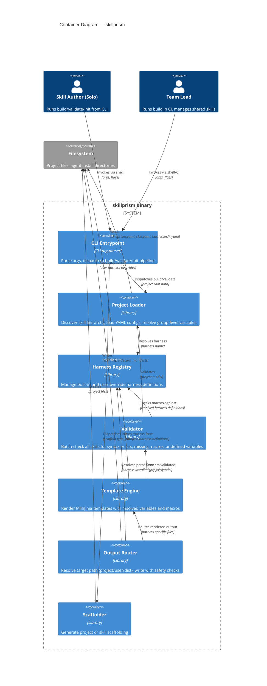

# Logical Containers

**Version:** v0.1.0

## Container Diagram

## Container Responsibilities

### CLI Entrypoint

| Field | Value |
| :--- | :--- |
| **Logical type** | CLI boundary |
| **Responsibility** | Parse command-line arguments (subcommand, flags, paths), validate flag combinations, dispatch to the correct pipeline handler (build, validate, init) |
| **Inputs** | Raw CLI args (`skillprism build --target user`, `skillprism validate`, `skillprism init`, etc.) |
| **Outputs** | Structured dispatch to build pipeline, validate pipeline, or scaffolder |
| **Depends on** | Nothing (entry point) |

### Project Loader

| Field | Value |
| :--- | :--- |
| **Logical type** | Library boundary |
| **Responsibility** | Walk the project directory tree starting from the project root. Discover and parse `skillprism.yaml`, traverse skill directories, load `skill.yaml` files per directory, resolve group-level variable inheritance (parent → child merge, child wins), and discover user harness overrides under `harnesses/` |
| **Inputs** | Project root path |
| **Outputs** | Resolved project model: list of skills (each with its resolved variables, template path, asset paths), list of user harness definitions |
| **Depends on** | Filesystem |

### Harness Registry

| Field | Value |
| :--- | :--- |
| **Logical type** | Library boundary |
| **Responsibility** | Maintain the set of built-in harness definitions (compiled into the binary). Accept user override harnesses (same name as built-in → fields merged or replaced) and custom harnesses (new name → added to registry) from the project loader. Resolve a harness definition by name to its full definition |
| **Inputs** | Harness name, optional user override definitions |
| **Outputs** | Resolved `HarnessDefinition` (built-in + user overrides applied) |
| **Depends on** | Compiled-in harness data, Project Loader (for user overrides) |

### Validator

| Field | Value |
| :--- | :--- |
| **Logical type** | Library boundary |
| **Responsibility** | For every skill in the project model: check template syntax by attempting to parse it, verify all macro references resolve against the assigned harness definition, verify all variable references resolve against the skill's resolved variable set. Collect all errors across all skills. Return a validated model if no errors, or a structured error report. |
| **Inputs** | Project model with resolved variables and harness definitions |
| **Outputs** | Validated project model (if clean) or structured error list |
| **Depends on** | Project Loader, Harness Registry, Template Engine (for parse checks) |

### Template Engine

| Field | Value |
| :--- | :--- |
| **Logical type** | Library boundary |
| **Responsibility** | Render a MiniJinja template string with the provided variable context and harness macro definitions. Return the rendered output. |
| **Inputs** | Template content, variable map, macro map |
| **Outputs** | Rendered string |
| **Depends on** | Template rendering engine |

### Output Router

| Field | Value |
| :--- | :--- |
| **Logical type** | Library boundary |
| **Responsibility** | Resolve the target output scope (project paths vs user home paths vs `dist/`) using the harness definition's installation path table. For each skill and harness, determine the exact output directory and filename. Write the rendered `SKILL.md`, sidecar files, and plugin manifests. Never write outside the resolved scope. Require confirmation before overwriting existing files unless `--force` is set. Perform atomic writes (temp file → rename). |
| **Inputs** | Rendered files per skill per harness, target scope, skill metadata, harness definitions |
| **Outputs** | Files written to disk |
| **Depends on** | Harness Registry (for installation paths), Filesystem |

### Scaffolder

| Field | Value |
| :--- | :--- |
| **Logical type** | Library boundary |
| **Responsibility** | Generate a new skillprism project directory (P1: SC-1) or scaffold a single skill within an existing project (P1: SC-2). Create `skillprism.yaml`, sample skill template, `harnesses/` directory placeholder. |
| **Inputs** | Scaffold type, target path, project name |
| **Outputs** | Created directory tree and files on disk |
| **Depends on** | Filesystem |
