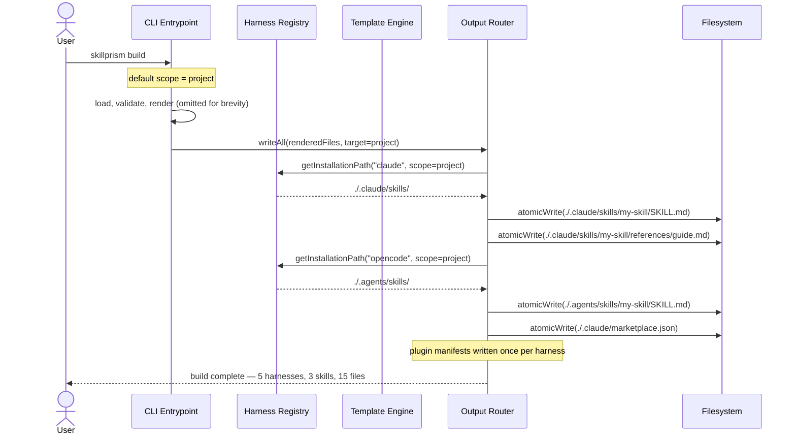

# Flow: Build to Project Scope

**PRD Capability:** BD-1 — Write all generated output to project-level harness paths by default, with each subdirectory mirroring the exact layout that harness expects.

**Primary actors:** Skill Author (Solo), Team Lead

## Sequence

