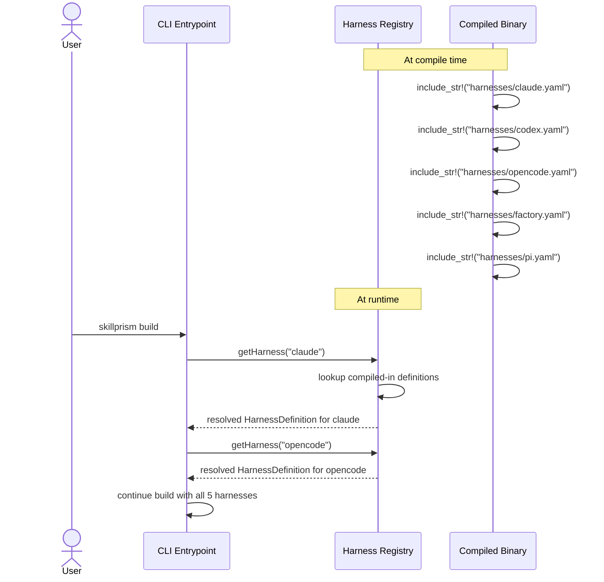

# Flow: Ship Built-in Harness Definitions

**PRD Capability:** HS-1 — Ship built-in harness definitions for Claude Code, Codex, OpenCode, Factory, and Pi that cover skill format, installation paths, subagent API patterns, invocation syntax, frontmatter fields, sidecar requirements, and validation strictness.

**Primary actors:** Skill Author (Solo), Team Lead, Tool Integrator

## Sequence

