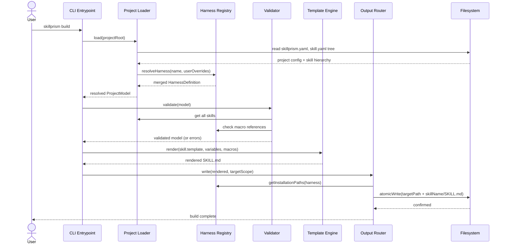

# Flow: Compile a Template

**PRD Capability:** TC-1 — Compile a template into a harness-specific SKILL.md file, resolving macro references and variable substitutions from the harness definition and skill configuration.

**Primary actors:** Skill Author (Solo), Team Lead

## Sequence

