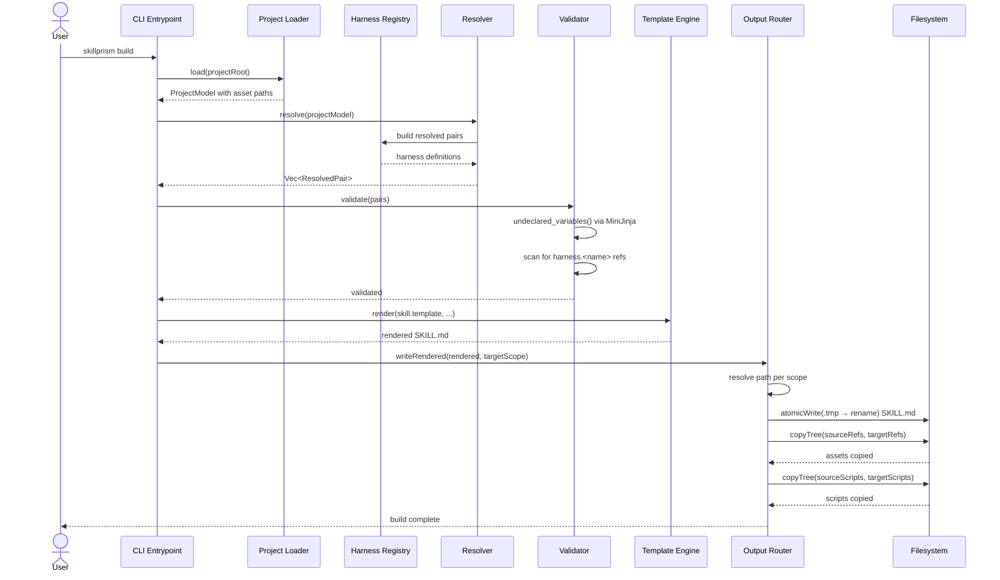

# Flow: Copy Shared Assets

**PRD Capability:** TC-2 — Copy shared assets (references/, scripts/) from the skill source to each harness output directory unchanged.

**Primary actors:** Skill Author (Solo), Team Lead

## Sequence

(End of file - total 45 lines)
