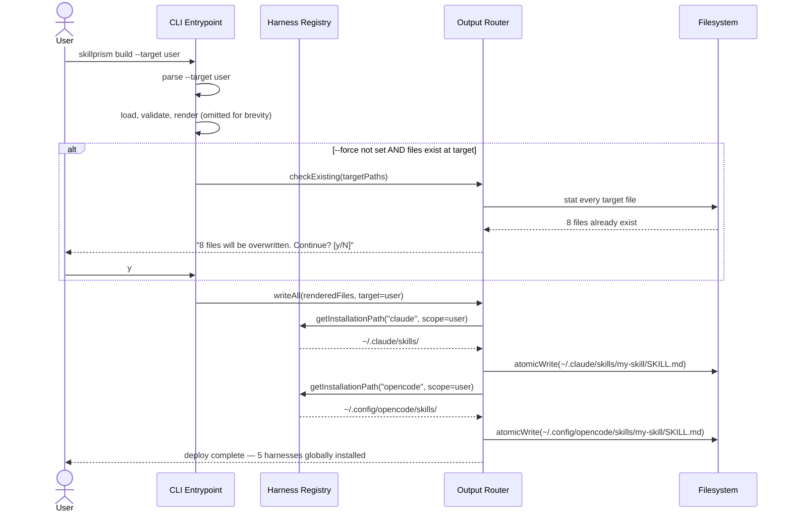

# Flow: Deploy to User Scope

**PRD Capability:** BD-2 — Accept a `--target` flag (project | user) that deploys generated output to the agent's installation path instead of the default project scope.

**Primary actors:** Skill Author (Solo), Team Lead

## Sequence

