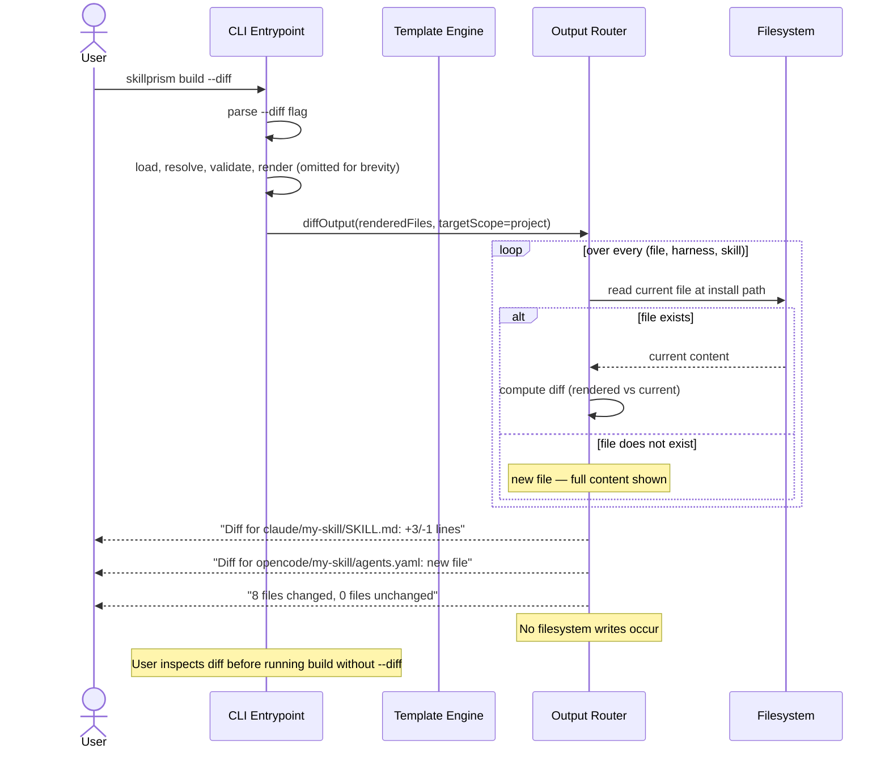

# Flow: Diff Build Output

**PRD Capability:** OB-1 — Generate a diff preview that compares rendered output against whatever currently exists at the target paths, without writing anything.

**Primary actors:** Skill Author (Solo), Team Lead

## Sequence

(End of file - total 40 lines)
