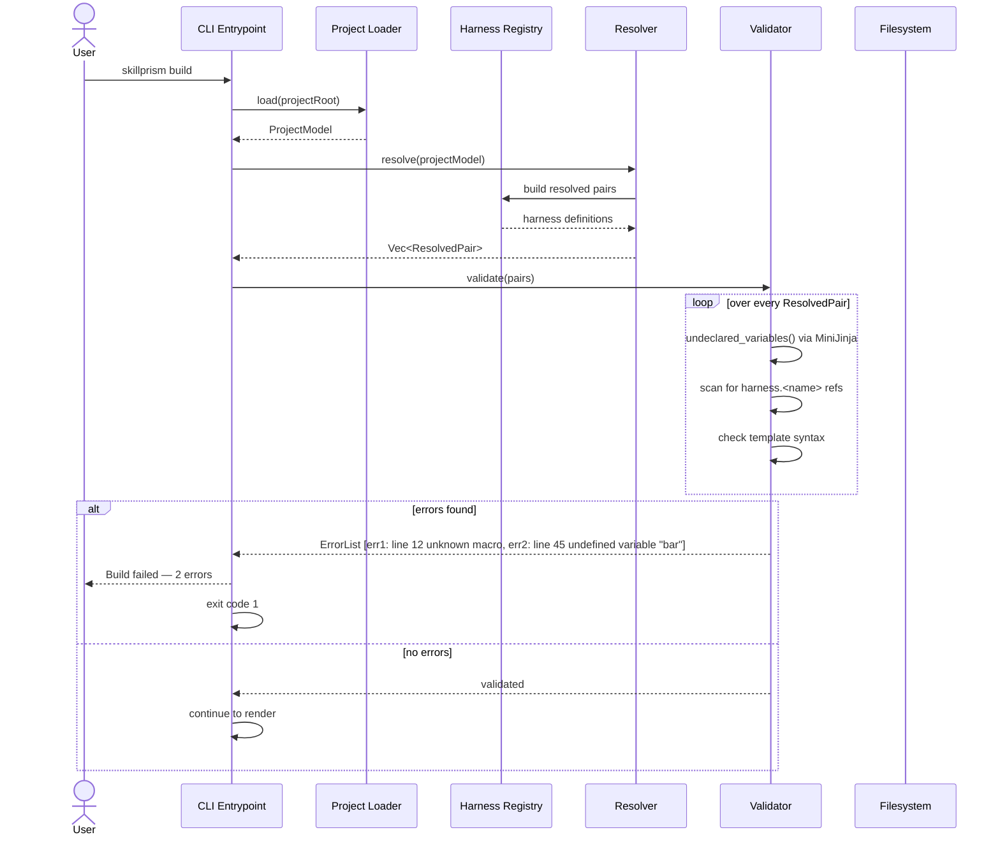

# Flow: Fail on Missing Reference

**PRD Capability:** TC-6 — Fail the build on any missing macro reference or undefined template variable.

**Primary actors:** Skill Author (Solo), Team Lead, CI pipeline

## Sequence

(End of file - total 43 lines)
