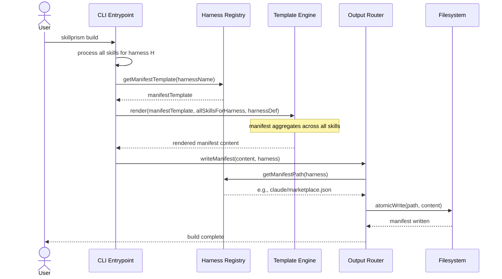

# Flow: Generate Plugin Manifest

**PRD Capability:** TC-5 — Generate harness-specific plugin manifests that register skills with the agent's discovery system.

**Primary actors:** Skill Author (Solo), Team Lead

## Sequence

