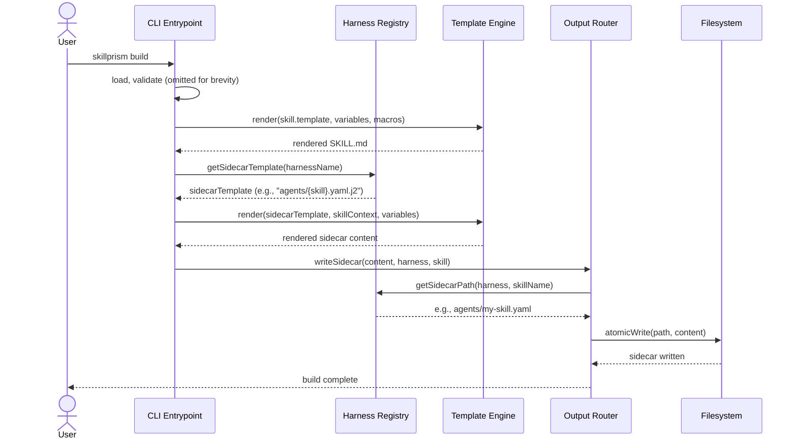

# Flow: Generate Sidecar Files

**PRD Capability:** TC-4 — Generate harness-specific sidecar files from inline templates defined in the harness definition.

**Primary actors:** Skill Author (Solo), Team Lead

## Sequence

