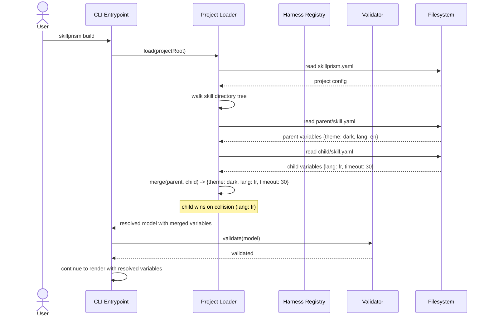

# Flow: Merge Group-Level Variables

**PRD Capability:** TC-3 — Merge group-level variables with per-skill variables (skill wins) before rendering each template.

**Primary actors:** Skill Author (Solo), Team Lead

## Sequence

