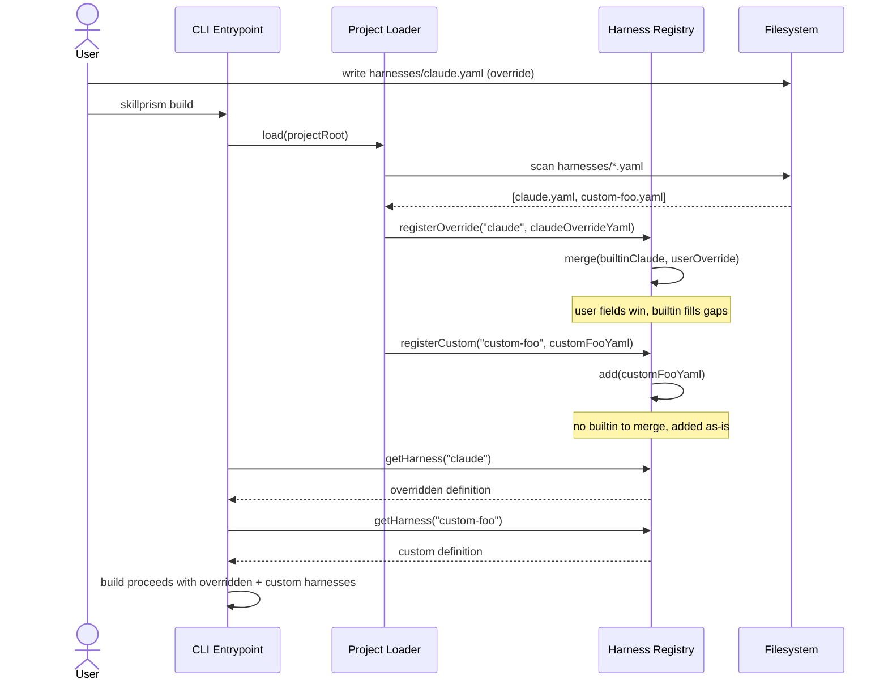

# Flow: Override Built-in Harness

**PRD Capability:** HS-2 — Allow users to override a built-in harness definition by placing a `harnesses/{name}.yaml` file in the project root.

**Primary actors:** Team Lead, Tool Integrator

## Sequence

