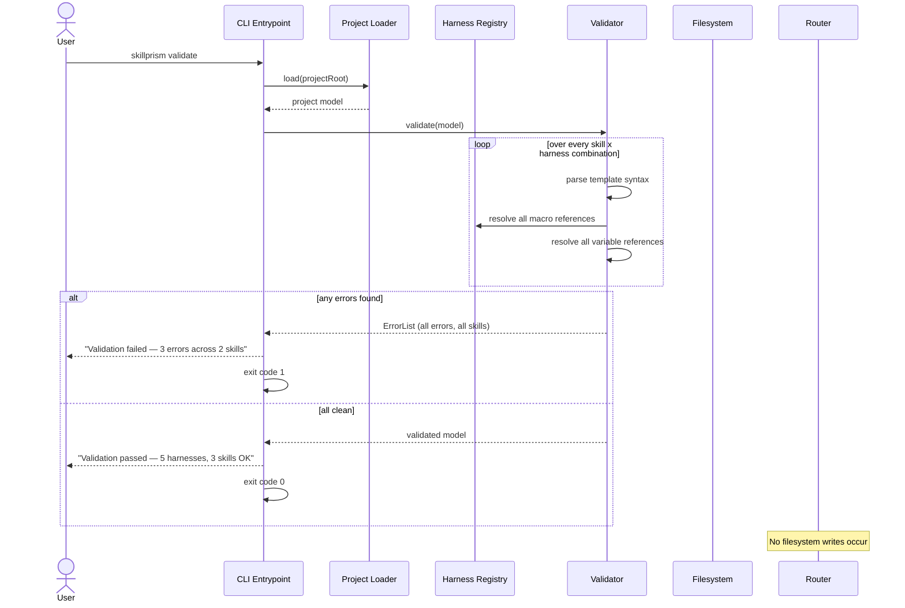

# Flow: Validate Without Writing

**PRD Capability:** VA-1 — Provide a validate command that checks template syntax, variable definitions, and macro references without writing output.

**Primary actors:** Skill Author (Solo), Team Lead, CI pipeline

## Sequence

