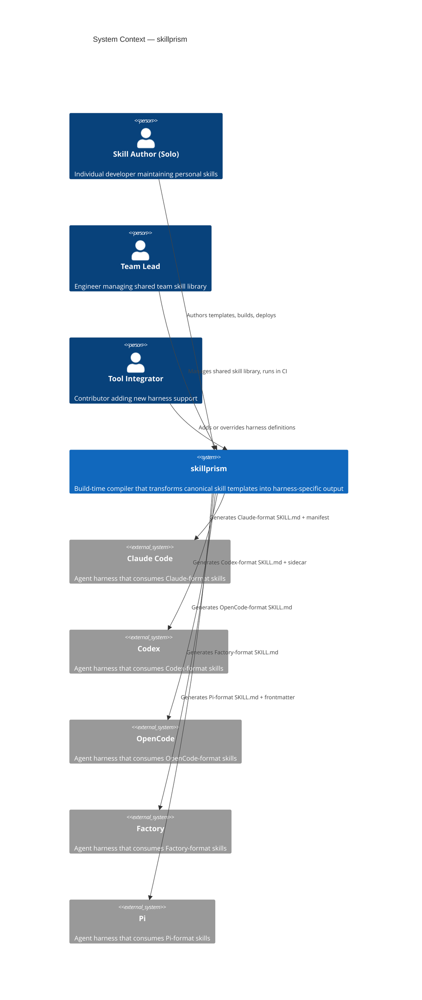
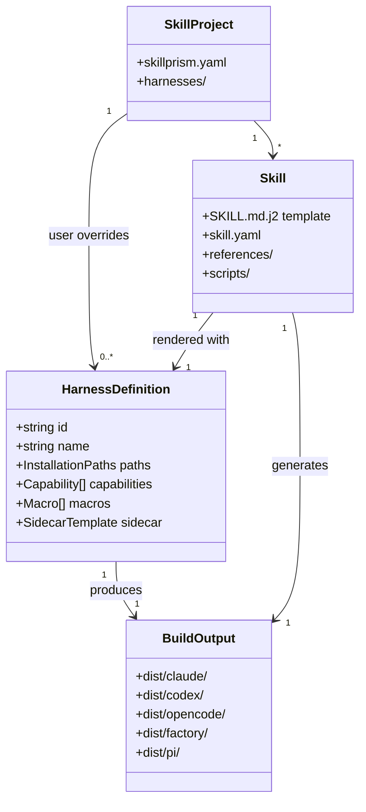

# Domain Model

## C4 Context Diagram

```mermaid
C4Context
  title System Context — skillprism

  Person(solo_author, "Skill Author (Solo)", "Individual developer maintaining personal skills")
  Person(team_lead, "Team Lead", "Engineer managing shared team skill library")
  Person(integrator, "Tool Integrator", "Contributor adding new harness support")

  System(skillprism, "skillprism", "Build-time compiler that transforms canonical skill templates into harness-specific output")

  System_Ext(claude, "Claude Code", "Agent harness that consumes Claude-format skills")
  System_Ext(codex, "Codex", "Agent harness that consumes Codex-format skills")
  System_Ext(opencode, "OpenCode", "Agent harness that consumes OpenCode-format skills")
  System_Ext(factory, "Factory", "Agent harness that consumes Factory-format skills")
  System_Ext(pi, "Pi", "Agent harness that consumes Pi-format skills")

  Rel(solo_author, skillprism, "Authors templates, builds, deploys")
  Rel(team_lead, skillprism, "Manages shared skill library, runs in CI")
  Rel(integrator, skillprism, "Adds or overrides harness definitions")
  Rel(skillprism, claude, "Generates Claude-format SKILL.md + manifest")
  Rel(skillprism, codex, "Generates Codex-format SKILL.md + sidecar")
  Rel(skillprism, opencode, "Generates OpenCode-format SKILL.md")
  Rel(skillprism, factory, "Generates Factory-format SKILL.md")
  Rel(skillprism, pi, "Generates Pi-format SKILL.md + frontmatter")
```

## Conceptual Domain

```mermaid
classDiagram
  class SkillProject {
    +skillprism.yaml
    +harnesses/
  }

  class Skill {
    +SKILL.md.j2 template
    +skill.yaml
    +references/
    +scripts/
  }

  class HarnessDefinition {
    +string id
    +string name
    +InstallationPaths paths
    +Capability[] capabilities
    +Macro[] macros
    +SidecarTemplate sidecar
  }

  class BuildOutput {
    +dist/claude/
    +dist/codex/
    +dist/opencode/
    +dist/factory/
    +dist/pi/
  }

  SkillProject "1" --> "*" Skill
  SkillProject "1" --> "0..*" HarnessDefinition : user overrides
  Skill "1" --> "1" HarnessDefinition : rendered with
  HarnessDefinition "1" --> "1" BuildOutput : produces
  Skill "1" --> "1" BuildOutput : generates
```
