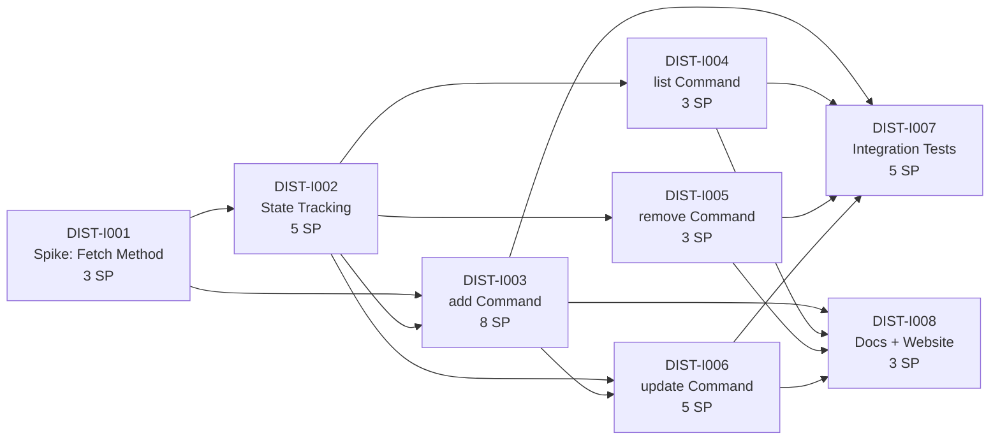

# Critical Path — Stage 4 v0.11.0

## Active Backlog Summary

- **Total Active Story Points:** 35
- **Active Epic:** Epic I (Distribution CLI) — 35 points
- **Completed:** Epic A (Foundation) — 9 points, Epic B (Pipeline) — 16 points, Epic C (DX) — 10 points, Epic D (SAFE) — 16 points, Epic E (SCAFF) — 7 points, Epic F (TEST) — 8 points, Epic G (CLEAN) — 9 points, Epic H (RELS) — 13 points = 88 total delivered

## Critical Path

1. **DIST-I001** — Spike: Remote Fetch Methodology (3 SP)
2. **DIST-I002** — State Tracking Layer (5 SP) — depends on I001
3. **DIST-I003** — `add` Command (8 SP) — depends on I001, I002
4. **DIST-I004** — `list` Command (3 SP) — depends on I002
5. **DIST-I005** — `remove` Command (3 SP) — depends on I002
6. **DIST-I006** — `update` Command (5 SP) — depends on I002, I003
7. **DIST-I007** — Integration Tests (5 SP) — depends on I003, I004, I005, I006
8. **DIST-I008** — Docs and Website Updates (3 SP) — depends on I003, I004, I005, I006

## Build Order Diagram

## Phasing Strategy

| Phase | Scope | Status |
|---|---|---|
| Phase 0–3 | Developer environment, Foundation, Pipeline, DX | ✅ Epics A–C — Completed |
| Phase 4 | Safety & Robustness | ✅ Epic D — Completed |
| Phase 5 | Scaffolding Enhancements | ✅ Epic E — Completed |
| Phase 6 | Testing & CI | ✅ Epic F — Completed |
| Phase 7 | Code Quality | ✅ Epic G — Completed |
| Phase 8 | Release Readiness | ✅ Epic H — Completed |
| Phase 9 | Distribution CLI | 🔵 Epic I — Active (35 SP) |

**8 epics completed (88 SP). 1 epic active (35 SP).**

## Notes

- **PRD dependency:** Epic I reopens `.constitution/prd/out-of-scope/plugin-marketplace.md` (operator directive). The PRD should be revised to reflect the new distribution capabilities, but the Tasks stage proceeds based on the operator's explicit direction.
- **Spike gate:** DIST-I001 is a hard gate — no implementation tickets (I002+) may proceed until the spike report is complete and the fetch methodology is chosen.
- **Parallelism after spike:** After I001 + I002, tickets I003/I004/I005 can be worked in parallel (they depend only on I002). I006 depends on I003 (reuses add's fetch+render pipeline). I007 and I008 depend on all command tickets.
- **Deferred scope:** `find` (requires directory/registry backend) and `use` (render-to-temp + agent launching) are deferred to future epics.
