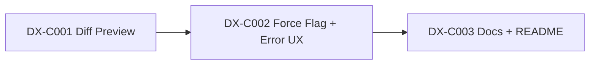

# Critical Path — Stage 4 v0.4.0

## Active Backlog Summary

- **Total Active Story Points:** 0
- **Completed:** Epic A (Foundation) — 9 points, Epic B (Pipeline) — 16 points, Epic C (DX) — 10 points = 35 total delivered
- **Critical Path:** None — all epics complete
- **Parallel Window:** N/A

## Build Order Diagram

## Phasing Strategy

| Phase | Scope | Status |
|---|---|---|
| Phase 0 | Developer environment (devenv, crate skeleton) | ✅ Epic A — Completed |
| Phase 1 | Foundation: CLI, Loader, Harness Registry | ✅ Epic A — Completed |
| Phase 2 | Pipeline: Resolver, Validator, Engine, Router | ✅ Epic B — Completed |
| Phase 3 | DX: Diff preview, error UX, documentation | ✅ Epic C — Completed |
| Future | Scaffolding enhancements | Deferred |
