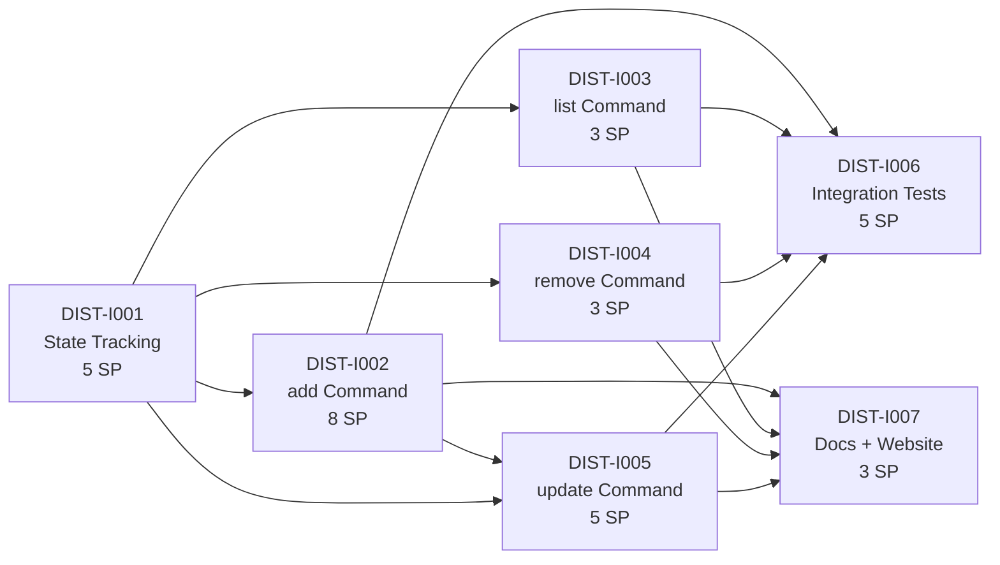

# Critical Path — Stage 4 v0.11.0

## Active Backlog Summary

- **Total Active Story Points:** 32
- **Active Epic:** Epic I (Distribution CLI) — 32 points
- **Spike (prerequisite, COMPLETE):** `.constitution/spikes/SPK-DIST-I001.md` — remote fetch methodology resolved. Implementation tickets reference the spike for contracts and mechanisms.
- **Completed:** Epic A (Foundation) — 9 points, Epic B (Pipeline) — 16 points, Epic C (DX) — 10 points, Epic D (SAFE) — 16 points, Epic E (SCAFF) — 7 points, Epic F (TEST) — 8 points, Epic G (CLEAN) — 9 points, Epic H (RELS) — 13 points = 88 total delivered

## Critical Path

1. **DIST-I001** — State Tracking Layer (5 SP) — no dependencies (spike complete)
2. **DIST-I002** — `add` Command (8 SP) — depends on I001
3. **DIST-I003** — `list` Command (3 SP) — depends on I001
4. **DIST-I004** — `remove` Command (3 SP) — depends on I001
5. **DIST-I005** — `update` Command (5 SP) — depends on I001, I002
6. **DIST-I006** — Integration Tests (5 SP) — depends on I002, I003, I004, I005
7. **DIST-I007** — Docs and Website Updates (3 SP) — depends on I002, I003, I004, I005

## Build Order Diagram

*Note: The spike `SPK-DIST-I001` lives in `.constitution/spikes/` and is complete; it is not part of the active critical path.*

## Phasing Strategy

| Phase | Scope | Status |
|---|---|---|
| Phase 0–3 | Developer environment, Foundation, Pipeline, DX | ✅ Epics A–C — Completed |
| Phase 4 | Safety & Robustness | ✅ Epic D — Completed |
| Phase 5 | Scaffolding Enhancements | ✅ Epic E — Completed |
| Phase 6 | Testing & CI | ✅ Epic F — Completed |
| Phase 7 | Code Quality | ✅ Epic G — Completed |
| Phase 8 | Release Readiness | ✅ Epic H — Completed |
| Phase 9 | Distribution CLI | 🔵 Epic I — Active (32 SP) |

**8 epics completed (88 SP). 1 epic active (32 SP).**

## Notes

- **Release plan:** Epic I must complete before the `v1.0.0` tag is cut. The `v1.0.0` milestone is no longer imminent — Epic I (32 SP) is the gate. With the spike complete, the critical path is `DIST-I001` (state layer) → `DIST-I002` (`add`) → `DIST-I005` (`update`). Once Epic I is archived, Epic J (deferred scope: `find`, `use`, plus any spike-driven follow-ups) is the natural successor before tagging v1.0.0.
- **PRD dependency:** Epic I reopens `.constitution/prd/out-of-scope/plugin-marketplace.md` (operator directive; the file carries a `[REOPENED 2026-07-02]` annotation and `prd/changelog.md` has a v0.2.0 entry). The full PRD revision that lifts the file out of `out-of-scope/` is a downstream follow-up; the Tasks stage proceeds based on the operator's explicit direction.
- **Spike status:** SPK-DIST-I001 is complete (see `.constitution/spikes/SPK-DIST-I001.md`). The implementation tickets in Epic I reference the spike for the contracts and mechanisms they need; no further spikes are required to start implementation.
- **Upstream amendments (this PR):** the network layer is unblocked by:
  - **Stage 1 (PRD) v0.2.0:** `.constitution/prd/constraints.md` allows `git` as a documented runtime dependency for distribution commands only.
  - **Stage 2 (Architecture) v0.2.2:** `.constitution/architecture/strategy.md` line 24 scopes the "no network" rule to non-distribution commands.
  - **Stage 3 (TechSpec) v0.11.0:** `ADR-008: Network Layer for Distribution` documents the design.
- **Parallelism after I001:** After DIST-I001 lands, tickets DIST-I002 / DIST-I003 / DIST-I004 can be worked in parallel (they depend only on I001). DIST-I005 depends on I002 (reuses `add`'s fetch+render pipeline). DIST-I006 and DIST-I007 depend on all command tickets.
- **Deferred scope:** `find` (requires directory/registry backend), `use` (render-to-temp + agent launching), and the `flock` follow-up are all deferred to future epics or follow-up tickets.
