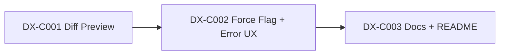

# Critical Path — Stage 4 v0.3.0

## Active Backlog Summary

- **Total Active Story Points:** 10
- **Completed:** Epic A (Foundation) — 9 points, Epic B (Pipeline) — 16 points = 25 total delivered
- **Critical Path:** DX-C001 → DX-C002 → DX-C003
- **Parallel Window:** None — Epic C tickets are strictly sequential.

## Build Order Diagram

## Phasing Strategy

| Phase | Scope | Status |
|---|---|---|
| Phase 0 | Developer environment (devenv, crate skeleton) | ✅ Epic A — Completed |
| Phase 1 | Foundation: CLI, Loader, Harness Registry | ✅ Epic A — Completed |
| Phase 2 | Pipeline: Resolver, Validator, Engine, Router | ✅ Epic B — Completed |
| Phase 3 | DX: Diff preview, error UX, documentation | 🟡 Epic C — Active |
| Future | Scaffolding (SC-1, SC-2 — P1) | Deferred |
