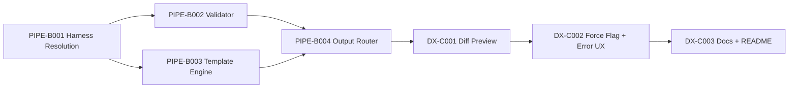

# Critical Path — Stage 4 v0.2.0

## Active Backlog Summary

- **Total Active Story Points:** 26
- **Completed:** Epic A (Foundation) — 9 points delivered
- **Critical Path:** PIPE-B001 → PIPE-B002 → PIPE-B003 → PIPE-B004 → DX-C001 → DX-C002 → DX-C003
- **Parallel Window:** PIPE-B002 (Validator) may run concurrently with PIPE-B003 (Template Engine) — both depend on PIPE-B001.

## Build Order Diagram

## Phasing Strategy

| Phase | Scope | Status |
|---|---|---|
| Phase 0 | Developer environment (devenv, crate skeleton) | ✅ Epic A — Completed |
| Phase 1 | Foundation: CLI, Loader, Harness Registry | ✅ Epic A — Completed |
| Phase 2 | Pipeline: Validator, Template Engine, Output Router | Epic B — Active |
| Phase 3 | DX: Diff preview, error UX, documentation | Epic C — Active |
| Future | Scaffolding (SC-1, SC-2 — P1) | Deferred |
