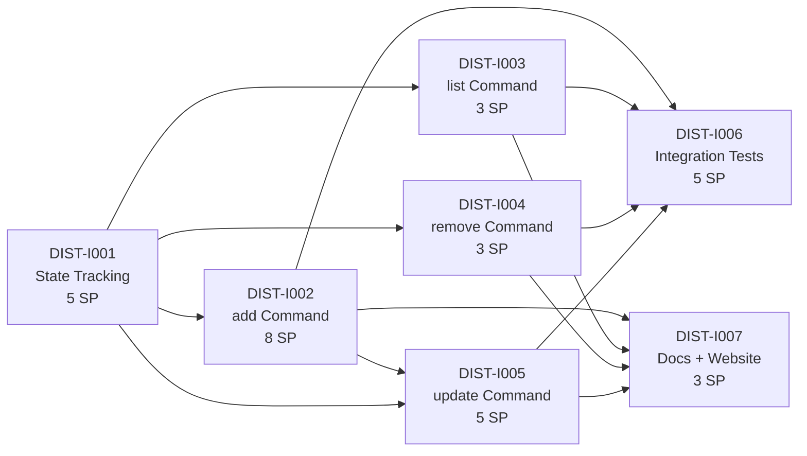

# Critical Path — Stage 4 v0.12.0

## Active Backlog Summary

- **Total Active Story Points:** 0
- **Completed:** Epic A (Foundation) — 9 points, Epic B (Pipeline) — 16 points, Epic C (DX) — 10 points, Epic D (SAFE) — 16 points, Epic E (SCAFF) — 7 points, Epic F (TEST) — 8 points, Epic G (CLEAN) — 9 points, Epic H (RELS) — 13 points, **Epic I (Distribution CLI) — 32 points** = 120 total delivered
- **No active epics.** The next epic (Epic J, deferred scope: `find`, `use`, plus any spike-driven follow-ups) is the natural successor before tagging v1.0.0.

## Critical Path

1. **DIST-I001** — State Tracking Layer (5 SP) — no dependencies (spike complete)
2. **DIST-I002** — `add` Command (8 SP) — depends on I001
3. **DIST-I003** — `list` Command (3 SP) — depends on I001
4. **DIST-I004** — `remove` Command (3 SP) — depends on I001
5. **DIST-I005** — `update` Command (5 SP) — depends on I001, I002
6. **DIST-I006** — Integration Tests (5 SP) — depends on I002, I003, I004, I005
7. **DIST-I007** — Docs and Website Updates (3 SP) — depends on I002, I003, I004, I005

## Build Order Diagram

*Note: The spike `SPK-DIST-I001` lives in `.constitution/spikes/` and is complete; it is not part of the active critical path.*

## Phasing Strategy

| Phase | Scope | Status |
|---|---|---|
| Phase 0–3 | Developer environment, Foundation, Pipeline, DX | ✅ Epics A–C — Completed |
| Phase 4 | Safety & Robustness | ✅ Epic D — Completed |
| Phase 5 | Scaffolding Enhancements | ✅ Epic E — Completed |
| Phase 6 | Testing & CI | ✅ Epic F — Completed |
| Phase 7 | Code Quality | ✅ Epic G — Completed |
| Phase 8 | Release Readiness | ✅ Epic H — Completed |
| Phase 9 | Distribution CLI | ✅ Epic I — Completed (32 SP) |

**9 epics completed (120 SP). No active epics.**

## Notes

- **Release plan:** Epic I is complete. The next epic (Epic J, deferred scope: `find`, `use`, plus any spike-driven follow-ups) is the natural successor before tagging v1.0.0.
- **PRD dependency:** Epic I reopens `.constitution/prd/out-of-scope/plugin-marketplace.md` (operator directive; the file carries a `[REOPENED 2026-07-02]` annotation and `prd/changelog.md` has a v0.2.0 entry). The full PRD revision that lifts the file out of `out-of-scope/` is a downstream follow-up.
- **Spike status:** SPK-DIST-I001 is complete (see `.constitution/spikes/SPK-DIST-I001.md`).
- **Architecture boundary preserved:** The distribution commands (`add`, `list`, `remove`, `update`) are the only network surface in skillprism. The static-binary, zero-network guarantee holds for all other commands.
