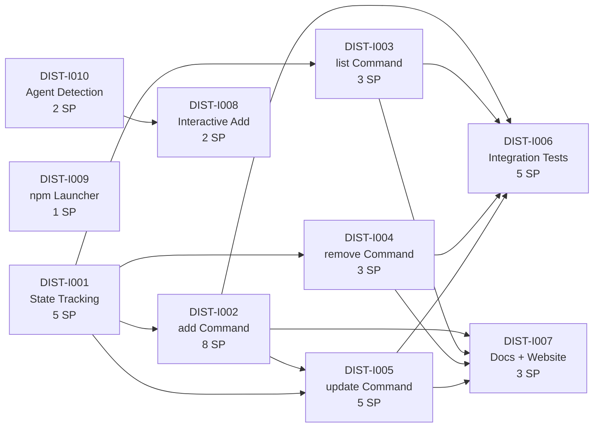

# Critical Path — Stage 4 v0.13.0

## Active Backlog Summary

- **Total Active Story Points:** 5
- **Active Epic:** Epic I (Distribution CLI) — Phase 2: 5 new SP (37 total including original 32)
- **Completed:** Epic A (Foundation) — 9 points, Epic B (Pipeline) — 16 points, Epic C (DX) — 10 points, Epic D (SAFE) — 16 points, Epic E (SCAFF) — 7 points, Epic F (TEST) — 8 points, Epic G (CLEAN) — 9 points, Epic H (RELS) — 13 points, **Epic I (Distribution CLI Phase 1) — 32 points** = 120 total delivered

## Critical Path

1. **DIST-I001** — State Tracking Layer (5 SP) — ✅ complete
2. **DIST-I002** — `add` Command (8 SP) — ✅ complete
3. **DIST-I003** — `list` Command (3 SP) — ✅ complete
4. **DIST-I004** — `remove` Command (3 SP) — ✅ complete
5. **DIST-I005** — `update` Command (5 SP) — ✅ complete
6. **DIST-I006** — Integration Tests (5 SP) — ✅ complete
7. **DIST-I007** — Docs and Website Updates (3 SP) — ✅ complete
8. **DIST-I010** — Agent Auto-Detection (2 SP) — no dependencies
9. **DIST-I008** — Interactive `add` Prompts (2 SP) — depends on I010
10. **DIST-I009** — npm Launcher (1 SP) — no dependencies

## Build Order Diagram

*Note: The spike `SPK-DIST-I001` lives in `.constitution/spikes/` and is complete; it is not part of the active critical path.*

## Phasing Strategy

| Phase | Scope | Status |
|---|---|---|
| Phase 0–3 | Developer environment, Foundation, Pipeline, DX | ✅ Epics A–C — Completed |
| Phase 4 | Safety & Robustness | ✅ Epic D — Completed |
| Phase 5 | Scaffolding Enhancements | ✅ Epic E — Completed |
| Phase 6 | Testing & CI | ✅ Epic F — Completed |
| Phase 7 | Code Quality | ✅ Epic G — Completed |
| Phase 8 | Release Readiness | ✅ Epic H — Completed |
| Phase 9 | Distribution CLI — Phase 1 | ✅ Epic I — Phase 1 Complete (32 SP) |
| Phase 9b | Distribution CLI — Phase 2 | 🔵 Epic I — Phase 2 Active (5 SP) |

**9 epics + Phase 2 active (125 SP total). 5 SP active.**

## Notes

- **Epic I reopened (2026-07-03):** Phase 2 addresses gaps identified during post-mortem comparison against Vercel's `skills` CLI v1.5.14. Three tickets added: agent auto-detection, interactive `add` prompts, and npm launcher binary distribution. Original 7 tickets (32 SP) remain complete.
- **Architecture boundary preserved:** The distribution commands (`add`, `list`, `remove`, `update`) are the only network surface in skillprism. The npm launcher downloads binaries but the Rust binary itself makes no network calls beyond `git`.
- **`find` deferred:** Can be implemented by querying Vercel's `skills.sh` API when prioritized — no registry backend needed. Wording updated in the epic file.
- **`use` command:** Explicitly ruled out. Not in scope.
