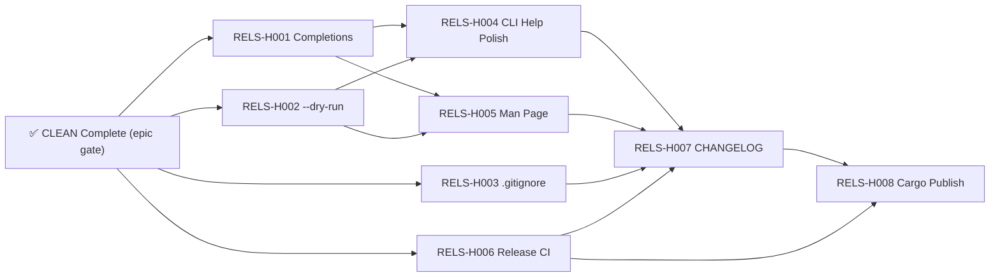

# Critical Path — Stage 4 v1.0.0

## Active Backlog Summary

- **Total Active Story Points:** 13
- **Active Epics:** H (RELS, 13 SP)
- **Completed:** Epic A (Foundation) — 9 points, Epic B (Pipeline) — 16 points, Epic C (DX) — 10 points, Epic D (SAFE) — 16 points, Epic E (SCAFF) — 7 points, Epic F (TEST) — 8 points, Epic G (CLEAN) — 9 points = 75 total delivered
- **Critical Path:** RELS-H001 → RELS-H004 → RELS-H007 → RELS-H008

RELS-H001/002/003/006 are independent of each other.
RELS-H004/005 depend on RELS-H001/002 (CLI finalization).
RELS-H007 depends on all tickets (last doc).
RELS-H008 depends on RELS-H006/007 (last action).

- **Parallel Windows:**
  - RELS-H001, RELS-H002, RELS-H003, RELS-H006 (4 tickets — first wave)
  - RELS-H004, RELS-H005 (2 tickets — after H001/H002)
  - RELS-H007, RELS-H008 (2 tickets — final wave)

## Build Order Diagram

## Phasing Strategy

| Phase | Scope | Status |
|---|---|---|
| Phase 0–3 | Developer environment, Foundation, Pipeline, DX | ✅ Epics A–C — Completed |
| Phase 4 | Safety & Robustness: path security, signals, error quality | ✅ Epic D — Completed |
| Phase 5 | Scaffolding Enhancements: init flags, sample skill, init harness | ✅ Epic E — Completed |
| Phase 6 | Testing & CI: integration tests, CI pipeline, hooks | ✅ Epic F — Completed |
| Phase 7 | Code Quality: remove dead code, clean lint allows | ✅ Epic G — Completed |
| Phase 8 | Release Readiness: completions, --dry-run, .gitignore, help polish, man page, release CI, changelog, cargo publish | 🔲 Epic H — Active (13 SP) |
