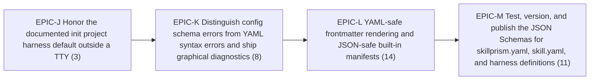

# Critical path

Generated by `constitution-tooling render` from `tasks/epics/`. Do not edit by hand; change the epic files and render again.

## Totals

| Active epics | Open points | Out-of-band epics | Out-of-band points | Waves | Widest wave | Longest chain (points) |
| :--- | :--- | :--- | :--- | :--- | :--- | :--- |
| 0 | 0 | 4 | 36 | 0 | 0 | 0 |

## Longest chain

No active in-band epics.

## Waves

An epic joins a wave when every dependency sits in an earlier wave and it is scope-disjoint from every other epic in the wave. A wave of one is a serial segment.

| Wave | Epic | Kind | Open points | Owns | May patch | Depends on |
| :--- | :--- | :--- | :--- | :--- | :--- | :--- |
| — | — | — | — | — | — | — |

## Out of band

Epics planned from issues. They run whenever the user chooses, outside the dependency graph, and must stay scope-disjoint from whatever wave is running.

| Epic | Source | Open points | Owns | Conflicts with |
| :--- | :--- | :--- | :--- | :--- |
| EPIC-J Honor the documented init project harness default outside a TTY | github#33 | 3 | `src/cli.rs`, `src/scaffold/project.rs`, `tests/integration.rs`, `site/content/docs/cli.md`, `site/content/docs/quickstart.md`, `README.md`, `CHANGELOG.md` | none |
| EPIC-K Distinguish config schema errors from YAML syntax errors and ship graphical diagnostics | github#31 | 8 | `src/types/error.rs`, `src/loader`, `src/registry/mod.rs`, `src/main.rs`, `src/cli.rs`, `Cargo.toml`, `Cargo.lock`, `tests/integration.rs`, `tests/fixtures`, `site/content/docs/quickstart.md`, `CHANGELOG.md` | none |
| EPIC-L YAML-safe frontmatter rendering and JSON-safe built-in manifests | github#34 | 14 | `src/engine`, `src/validator`, `src/cli.rs`, `src/types/error.rs`, `src/router/manifest.rs`, `src/router/mod.rs`, `src/builtin_harnesses`, `src/scaffold/skill.rs`, `src/scaffold/project.rs`, `examples`, `tests`, `site/content/docs`, `README.md`, `CHANGELOG.md`, `Cargo.toml`, `Cargo.lock` | none |
| EPIC-M Test, version, and publish the JSON Schemas for skillprism.yaml, skill.yaml, and harness definitions | github#32 | 11 | `schemas`, `tests/schemas.rs`, `Cargo.toml`, `Cargo.lock`, `site/hugo.toml`, `site/content/docs`, `src/scaffold`, `src/types/project.rs`, `src/loader/project.rs`, `src/registry/types.rs`, `examples`, `tests/fixtures`, `README.md`, `CHANGELOG.md` | none |

## Build order

```mermaid
flowchart LR
  J["EPIC-J Honor the documented init project harness default outside a TTY (3)"]
  K["EPIC-K Distinguish config schema errors from YAML syntax errors and ship graphical diagnostics (8)"]
  L["EPIC-L YAML-safe frontmatter rendering and JSON-safe built-in manifests (14)"]
  M["EPIC-M Test, version, and publish the JSON Schemas for skillprism.yaml, skill.yaml, and harness definitions (11)"]
  J --> K
  K --> L
  L --> M
```

An arrow points from a prerequisite to the epic that depends on it, so it reads in the order work flows, the same direction as the longest chain above.

## Ticket order inside each epic

A dependency-respecting listing, not a chain: `needs` names a ticket's own `depends_on` inside its epic, and a ticket without one has no in-epic dependency. Readiness is epic-level: a ticket finished on an unmerged branch satisfies no other epic's dependency until the containing PR merges.

- **EPIC-J:** SKP-J001, SKP-J002 (needs SKP-J001)
- **EPIC-K:** SKP-K001, SKP-K002 (needs SKP-K001), SKP-K003 (needs SKP-K001, SKP-K002)
- **EPIC-L:** SKP-L001, SKP-L002 (needs SKP-L001), SKP-L003 (needs SKP-L001, SKP-L002), SKP-L004, SKP-L005 (deferred; needs SKP-L003)
- **EPIC-M:** SKP-M001, SKP-M002 (needs SKP-M001), SKP-M003 (needs SKP-M002), SKP-M004 (needs SKP-M002)

## Concurrency mechanics

- **Worktree:** ../skillprism-epic-<ID>
- **Branch naming:** feat/epic-<id>-<slug>
- **Merge strategy:** squash
